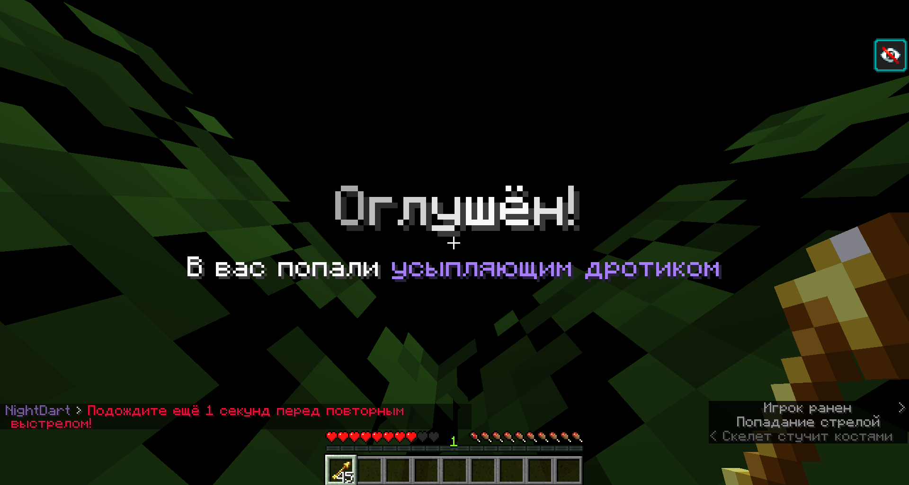

<center>

<p><b>NightDart</b> - Paper plugin that adds a sleeping dart!</p>

<u>English</u> | <b><a href="README_RU.md">Russian</a></b>
</center>

***

# 🚀 Features

- Fully **customizable**!
- **Cooldown** for usage
- **HEX colors** and full MiniMessage support!

# 💾 Requirements

- Java **17+**
- Paper (or forks such as Purpur) **1.18+** <u>(not Spigot/CraftBukkit)</u>

# ⚡ Commands and permissions

## /nightdart

> [!TIP]
> Alias: **/dart**

### Subcommands:
- /nightdart give [count] [player]
  - Permission: `nightdart.player.give`
- /nightdart reload
  - Permission: `nightdart.admin.reload`

### Permission for use: `nightdart.player.use`

# 📸 How it look


<details><summary>GIF showcase</summary>


</details>

# 📜 Metrics

You can check statistic about this plugin [here](https://bstats.org/plugin/bukkit/NightDart/23806) and disable sending in `config.yml` by setting `enable-metrics: false`


***


# ⚙ Other information

### If you find a bug or want to help with development, feel free to contact me
- Contact links [here](https://drakoshaslv.ru/)

### You can also (optionally) donate me:
- [DonationAlerts](https://www.donationalerts.com/r/mrdrag0nxyt)
- TON:
  ```
  UQAwUJ_DWQ26_b94mFAy0bE1hrxVRHrq51umphFPreFraVL2
  ```
- ETH:
  ```
  0xf5D0Ab258B0f8EeA7EA07cF1050B35cc12E06Ab0
  ```


<center><h3>Made specially for <a href="https://nshard.ru">NightShard</a></h3></center>

